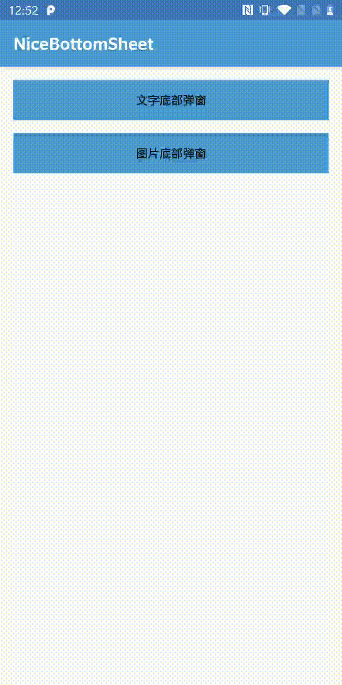

#### 库文件引用

```
implementation 'com.android.support:design:28.0.0'
implementation 'com.znvip.nicebottomsheet:nicebottomsheet:1.0.2'
```

#### NiceBottomSheet(底部弹窗)



使用方法：

```
fun showBottomSheet() {
    NiceBottomSheet.newInstance()
        .setUpdateUIListener {
              // default title view
              it.configDefaultTitleView { parent,titleView,backView ->
                  // do something
                  titleView.text = "文字"
              }
              // custom title view
              it.setTitleView(TextView(this).apply {
                  text = "文字"
                  gravity = Gravity.CENTER
                  setBackgroundColor(Color.YELLOW)
              }).setContentView(ll)
        }
        .showBySelfGrowthTag(supportFragmentManager)
}
```

可配置项：

1.最小高度（setMinHeight）

2.顶部间距（setMarginTop）

3.拖动开关（banDrop）

4.禁止拖动后状态 （banDropState）

5.默认头部（configDefaultTitleView）与自定义头部（setTitleLayoutResId or setTitleView）

6.移除头部（hasTitleView）