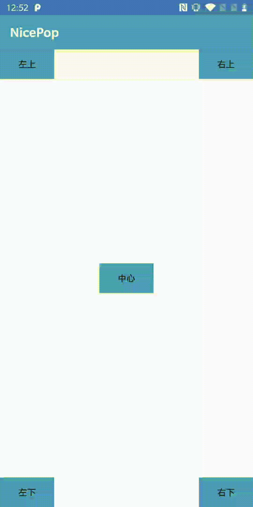

#### NicePop(上下方向自适应弹窗)



使用方法：

```
fun showPop(view: View) {
    val pop = NicePop(context)
    // 设置弹窗的布局
    pop.contentView = FrameLayout(context)
    // 设置是否显示箭头
    pop.showArrow = true/false
    // 设置向上箭头的图片
    pop.setUpArrow(drawableResId)
    // 显示弹窗
    pop.showAsDropDown(view)
}
```